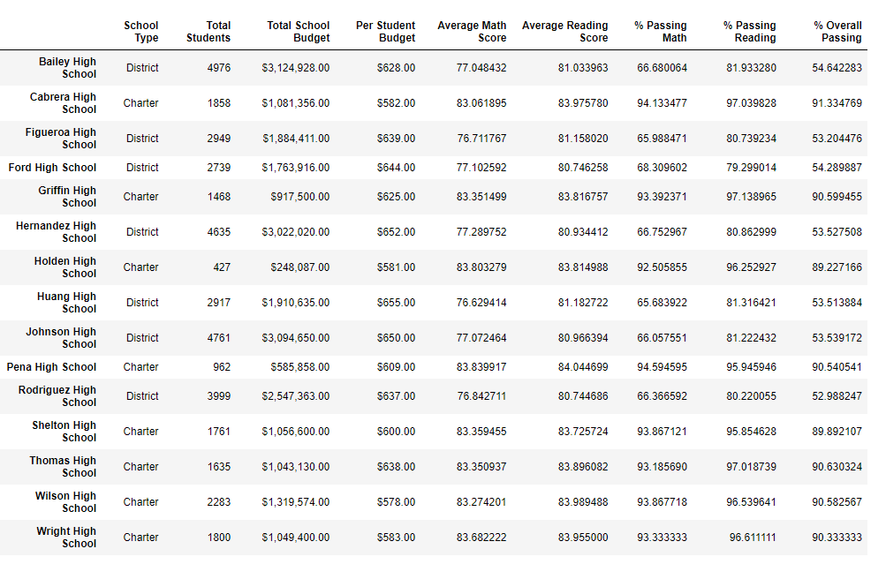

# School District Analysis - Module 4 Challenge

## Overview of the School District Analysis

The purpose of this project is to complete an analysis of a school district after a set of values were determined to be inadmissiable from academic dishonesty. As such, a previous analysis of the school district needs to be recreated, exclusing the data from Thomas High School's Grade 9 results.

The objectives for this analysis is to firstly correct the data in the databases for the analyis, then recreate the analysis of:
- The district summary;
- The school summary;
- The top 5 and bottom 5 performing schools, based on the overall passing rate;
- The average math score for each grade level from each school;
- The average reading score for each grade level from each school; and
- The scores by school spending per student, by school size, and by school type.

## Resources Used
- Data Source: schools_complete.csv, students_complete.csv
- Software: Python 3.7.6, Visual Studio Code 1.63.2, Conda 4.11.0, Jupyter Notebook 6.4.6

## Analysis and Results

The original analysis results can be found in the original PyCitySchools.ipnyb file. The corrected analysis with the results of Thomas High School's 9th Grade results omitted can be found in PyCitySchools_Challenge.ipnyb.

### Analysis Results

- There was little change in the district summary, shown below. If the results were rounded to whole numbers, there would be no observable change.


- The school summary results only changed for Thomas High School, as it was the only school that had data changed. Despite the 9th grade data being removed from analysis, there was very little change in the data.


- The corrected data did not change the top five or bottom five school analysis. Thomas High School is still ranked second in overall performance on the math and reading scores in both the original and corrected analysis, despite the slight change to their scores.
- There was no difference in the by grade analysis with the exception of the Thomas High School's 9th Grade results displaying as "nan" to represent the removed data. An example of the corrected math table is shown below.

- For the Spending Range Analysis, Thomas High School is in the $630-644 bin. However, the results of this analysis did not change at all, with each value staying the same.
- For the school size analysis, Thomas High School is in the Medium bin with student counts of 1000-2000. The results of the analysis did not change at all.
- For the school type analysis, Thomas High School is a district school. Similar to the other analyses, the results did not change from the omission of the 9th grade results. 


## Summary

- The biggest change of the analysis is the method the results were calculated. Both for the district summary and school analysis, while the official count of students did not change, the total number of 9th grade students had to be removed from the analysis or else the data would have skewed significantly lower. The code used for this part of the analysis was shown below and subtracted for the district and school analyses.
```
ninththomas_count = school_data_complete_df.loc[(school_data_complete_df["school_name"] == "Thomas High School") & (school_data_complete_df["grade"] == "9th"),:]["Student ID"].count()
```
- The second most noticible change is the display in the analysis that divides the test results by grade. As shown above, the 9th Grade results for Thomas High School shows "nan" in the grade column. If used for a future report, a note may be needed to explain why this data is blank, or change the value to something that may be more legible.

- After those two, the changes are less significant. One noticable reason for this can be seen in the original grade analysis. Shown below is code added to PyCitySchool.ipnyb to quickly pull the original Thomas High School results out of the analysis. While not exactly the same and can be weighted by the amount of 9th grade students, the average results of the 9th grade is close to the results achieved by the other grades. As such, removing the data was not likely to have largely significant results. If the 9th grade had drastically different results instead, the analysis may have changed more significantly.


- The last change was slight adjustments to the decimal point values of the percentages in the district and school summary, which showed results that were not reformatted and rounded off. While these data points have literally shown changes, a decision on significant digits that may be applied to the data may show the results have not changed significantly at all. However, the methods used to eliminate a specific grades's results could still be useful for future analyses where there might be more drastic differences in data.

